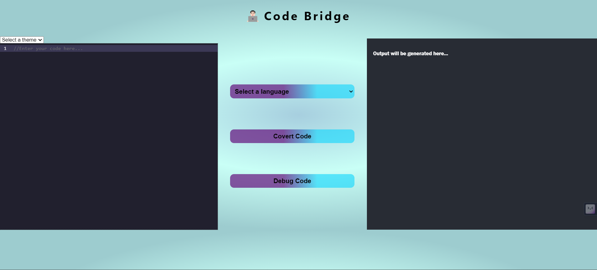

<h1 align="center">🌉 Code Bridge 🌉</h1>

  

## About

Code Bridge is your go-to tool for seamlessly converting code between different programming languages while also offering robust debugging capabilities. Whether you're translating a snippet for a new project or squashing pesky bugs, Code Bridge has you covered.

## Features

- **Language Translation:** Convert code from one programming language to another with ease.
- **Advanced Debugging:** Unravel the mysteries of your code with powerful debugging tools.
- **User-Friendly Interface:** Sleek and intuitive UI built with React for a delightful user experience.
- **API Integration:** Access conversion functionalities effortlessly via the provided Postman API.

## Technologies Used

- **React:** Craft captivating user interfaces with this cutting-edge front-end framework.
- **Node.js & Express.js:** Powerhouse duo for building robust back-end servers and APIs.
- **Postman:** Simplify API development and testing with this versatile tool.

## Installation

To get started with Code Bridge locally, simply follow these steps:

1. **Clone this repository:** `git clone <repository-url>`
2. **Navigate to the project directory:** `cd code-bridge`
3. **Install dependencies:** `npm install`
4. **Start the server:** `npm start`
5. **Open your browser and visit:** `http://localhost:3000`

1. **Input Your Code:** Enter your code snippet into the designated area.
2. **Select Languages:** Choose the source and target programming languages for translation.
3. **Debugging Magic:** Use the built-in tools to debug and troubleshoot your code effectively.

